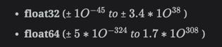

# Overview of data types

This describes the data types in Go.

The following topics are covered:
- Types
- Type conversions

---

## Primitive types

`int`, `float`, `bool`, `string`

---

## Integer types

Go has architecture-dependent types such as `int`, `uint`, and `uintptr`.
They have the appropriate length for the machine on which a program runs.

An `int` is a default signed type, which means it takes a size of 32 bit (4 bytes) on a 32-bit machine and 64 bit (8 bytes) on a 64-bit machine, and the same goes for uint (`unsigned int`).
Meanwhile, `uintptr` is an unsigned integer large enough to store a bit pattern of any pointer.

The architecture independent types have a fixed size (in bits) indicated by their names.=

For _signed_ integers:

- `int8` (`-128` to `127`)
- `int16` (`-32768` to `32767`)
- `int32` (`−2,147,483,648` to `2,147,483,647`)
- `int64` (`−9,223,372,036,854,775,808` to `9,223,372,036,854,775,807`)

For _unsigned_ integers:

- `uint8` (with the alias byte, `0` to `255`)
- `uint16` (`0` to `65,535`)
- `uint32` (`0` to `4,294,967,295`)
- `uint64` (`0` to `18,446,744,073,709,551,615`)

#### Code demonstration

```go
package main

import "fmt"

func main() {
    printIntegers()
}

func printIntegers() {
    var unsignedIntExample1 uint8
    fmt.Println(unsignedIntExample1)
    var unsignedIntExample2 uint16
    fmt.Println(unsignedIntExample2)
    var unsignedIntExample3 uint32
    fmt.Println(unsignedIntExample3)
    var unsignedIntExample4 uint64
    fmt.Println(unsignedIntExample4)
	
    var signedIntExample1 int8
    fmt.Println(signedIntExample1)
    var signedIntExample2 int16
    fmt.Println(signedIntExample2)
    var signedIntExample3 int32
    fmt.Println(signedIntExample3)
    var signedIntExample4 int64
    fmt.Println(signedIntExample4)
}
```

## Machine-dependent integer types

There are 3 machine-dependent (e.g., size occupied depends on architecture) integer types:

- `uint`
- `int`
- `uintptr`

#### Code demonstration

```go
package main

import "fmt"

func main() {
    printMachineDependentIntegerTypes()
}

func printMachineDependentIntegerTypes() {
    var unsignedIntExample uint
    fmt.Println(unsignedIntExample)
    var signedIntExample int
    fmt.Println(signedIntExample)
    var unsignedIntPtrExample uintptr
    fmt.Println(unsignedIntPtrExample)
}
```

`int` offers the fastest processing speeds.
The initial (default) value for integers is `0` (floats default to `0.0`).

---

## Alias types

In Go, alias types are a way to create a new name for an existing type. They are useful for adding more semantic meaning to your code or for gradual code refactoring.
Here's a detailed guide on alias types in Go, with code examples.

### Introduction to Alias Types

An alias type in Go is declared using the `type` keyword, followed by the new type name and the original type.
The alias type is fully compatible with the original type, meaning values of the alias type can be used wherever the original type is expected and vice versa.

**Basic Syntax**

```
type AliasTypeName OriginalType
```

### The `byte` and `rune` special types

In Go, byte and rune are special types that represent specific kinds of integers, each with its unique purpose and use case.

#### `byte` keyword

The `byte` type is an alias for `uint8`, an unsigned 8-bit integer. It represents an ASCII character.

**Common Usage**

- Primarily used to manipulate individual bytes.
- Often seen in tasks related to handling raw binary data, byte streams in I/O operations, or processing ASCII character data.
- Example: Reading files byte by byte, handling binary protocols, or working with ASCII character sets.

#### `rune` keyword 

The `rune` type is an alias for `int32`, a signed 32-bit integer. It represents a Unicode code point.

**Common Usage**

- Used to handle Unicode characters, which may be more than one byte in size.
- Essential for processing text in various languages and symbols not covered in the ASCII range.
- Example: Parsing strings in multi-language applications, handling emojis, or working with any Unicode characters.

#### Code examples

```go
package main

import "fmt"

func main() {
    var aliasedUnsignedInt byte
    fmt.Println(aliasedUnsignedInt)
}
```

```go
package main

import "fmt"

func main() {
    var r rune = 'あ'
    fmt.Println(r) // Outputs: 12354 (Unicode code point for 'あ')
}
```

---

### Floating-point types

Go has two floating-point types:

- `float32`
- `float64`

also often referred to as single precision and double precision respectively.



>**Note**: Unlike other languages, a `float` types on its own does not exist in Golang. We have to specify the bits. For example, `float32` or `float64`.

>Go also has two additional types for representing complex numbers (e.g., numbers with imaginary parts):
>- `complex64`
>- `complex128`

Float types default to an initial value of `0.0`. A `float32` is reliably accurate to about 7 decimal places, and a `float64` to about 15 decimal places.

Generally you should use `float64` when working with floating-point numbers.
All the functions of the `math` package expect that type.

#### Code example

```go
package main

import "fmt"

func main() {
    var floatExample1 float32
    fmt.Println(floatExample1)
    var floatExample2 float64
    fmt.Println(floatExample2)
    var complexExample1 complex64
    fmt.Println(complexExample1)
    var complexExample2 complex128
    fmt.Println(complexExample2)
	
    fmt.Println("1.0 + 1.0 = ", 1.0 + 1.0)
    fmt.Println("1 + 1.0 = ", 1 + 1.0)
}
```

>Numbers may be denoted in:
> - Octal notation with a prefix of `0`: _63_ can be written as `077`.
> - Hexadecimal notation with a prefix of `0x`: _255_ can be written as `0xFF`.
> - Scentific notation with `e`, which represents the _power of 10_.

### Type mixing

As Go is strongly typed, the mixing of types is not allowed, as in the following program.

```go
package main

func main() {
	var a int
	var b int32
	a = 15
	b = a + a // compiler error
	b = b + 5 // ok: 5 is a constant
}
```

The program will give a compiler error: `cannot use a + a (type int) as type int32 in assignment`.
Note that constants are considered to have no type in Go. The line

```
b = b + 5
```

will work fine because 5 is a constant, not a variable. Hence, with constants, mixing is allowed.

Similarly, if we declare two variables as:

```
var n int16 = 34
var m int32
```

and we do

```
m = n
```

it will give a compiler error: `cannot use n (type int16) as type int32 in assignment`.
Because an `int16` cannot be assigned to an `int32`, there is no implicit casting.

In the following program, an explicit conversion is done to avoid this:

```go
package main
import "fmt"

func main() {
	var n int16 = 34
	var m int32
	
	m = int32(n)
	fmt.Printf("32 bit int is: %d\n", m)
	fmt.Printf("16 bit int is: %d\n", n)
}
```

In the above code, `n` is an `int16` variable, and `m` is an `int32` variable.
To set the value of `m` equal to `n`, we need explicit type casting because these variables have different types.
On the line of code that reads

```
m = int32(n)
```

casts `n` with a type of `int32` as the data type of `m` is `int32`, not `int16`.
Then the results are printed.

---

### Format specifiers

In Go (or Golang), format specifiers are placeholders used in formatting strings with the fmt package.
They allow you to control the output of values within a string by specifying the type and formatting options.
Format specifiers are usually preceded by a percent sign (`%`) and are followed by a letter that represents the type of value to be formatted, along with optional additional information.

Here are some common Golang format specifiers:

- `%s`: Used for formatting strings. It replaces the specifier with a string.
- `%d` or `%v`: Used for formatting integers. `%d` is for decimal formatting, while `%v` is for general formatting.
- `%f`: Used for formatting floating-point numbers (float64).
- `%t`: Used for formatting boolean values (true or false).
- `%c`: Used for formatting characters (runes).
- `%b`: Used for formatting integers in binary (base 2).
- `%o`: Used for formatting integers in octal (base 8).
- `%x` or `%X`: Used for formatting integers in hexadecimal (base 16), with `%x` producing lowercase and `%X` producing uppercase letters.

You can also use additional options with format specifiers to control width, precision, and other formatting details.
For example, `%5d` specifies that an integer should be formatted in a field of at least 5 characters wide.
The `Printf` or `Sprintf` functions from the `fmt` package are commonly used to format strings with these specifiers.

Example:

```go
package main

import "fmt"

func main() {
	name := "Alice"
	age := 30
	fmt.Printf("Name: %s, Age: %d\n", name, age)
}
```

In this example, the `%s` and `%d` format specifiers are used to format the `name` and `age` variables within the string.
When the program is executed, it will replace `%s` with the value of `name` (which is "Alice") and `%d` with the value of `age` (which is 30), resulting in the formatted output: `Name: Alice, Age: 30`.

---

### Random numbers

Some programs, like games or statistical applications, need random numbers.
The package `math/rand` implements pseudo-random number generators.
For a simple example, see the following program that prints a random number:

```go
package main

import (
	"fmt"
	"math/rand"
)

func main() {
	a := rand.Int()    // generates a random number
	b := rand.Intn(8)  // generates a random number in [0, n)
	fmt.Printf("a is: %d\n", a)
	fmt.Printf("b is: %d\n", b)
}
```

In the above program, you can see that a package `math/rand` is imported to generate random numbers.
We declare a variable `a`. In `a`, a random value is placed. But if we want to create a random number with a range, we can use the `Intn(n)` function.
Random values of range: [0, n) (starting from **0** to **n-1**) can be generated.
So we made a variable `b` and set it as a random number from `0` to `7`, then `a` and `b` are printed, respectively.

---

### Character type

Strictly speaking, this is not a type in Go.
The characters are a _special case of integers_.
THe `byte` type is an _alias_ for `uint8`, and this is okay for the traditional ASCII-encoding for characters (1 byte).
A `byte` type variable is declared as

```
var ch byte = 65
```

Single quotes `''` surround a character.
In the ASCII-table the decimal value for `A` is `65`, and the hexadecimal value is `41`.
The following are also declarations for the character `A`:

```
var ch byte = 65
```

or

```
var ch byte = '\x41'
```

`\x` is always followed by exactly two hexadecimal digits. Another possible notation is `\` followed by exactly 3 octal digits, e.g., `\377`.

But there is also support for **Unicode (UTF-8)**. Characters are also called _Unicode code points_, and a Unicode character is represented by an _int_ in memory.
In the documentation, they are commonly represented as **U+hhhh**, where _h_ is a hexadecimal digit.
In fact, the type **rune** exists in Go and is an _alias_ for type **int32**.
To write a Unicode-character in code, preface the hexadecimal value with `\u` or `\U`.
If 4 bytes are needed for the character, `\U` is used.
Where `\u` is always followed by exactly _four_ hexadecimal digits and `\U` by _eight_.

Run the following program to see how the _Unicode character_ type works.

```go
package main

import "fmt"

func main() {
	var ch1 int = '\u0041'
	var ch2 int = '\u03B2'
	var ch3 int = '\U00101234'
	fmt.Printf("%d - %d - %d\n", ch1, ch2, ch3)  // integer
	fmt.Printf("%c - %c - %c\n", ch1, ch2, ch3)  // character
	fmt.Printf("%X - %X - %X\n", ch1, ch2, ch3)  // UTF-8 bytes
	fmt.Printf("%U - %U - %U", ch1, ch2, ch3)    // UTF-8 code point
}
```

The declared characters `ch1` and `ch2` are represented by four bytes because we used `\u`.
Where `ch3` is represented with eight bytes using `\U`.
You may have noticed that we print these characters using four different format specifiers:

- `%d`
- `%c`
- `%X`
- `%U`

In format-strings, `%c` is used as a format specifier to show the character.
Format-specifiers `%v` or `%d` show the integer representing the character, and `%U` outputs the `U+hhhh` notation.

---

### The `unicode` package

The package _unicode_ has some useful functions for testing characters. Suppose we have a character named `ch`.
The following are some main functions from this package:

- Testing for a letter

  ```
  unicode.IsLetter(ch)
  ```
  
- Testing for a digit

  ```
  unicode.IsDigit(ch)
  ```
  
- Testing for a whitespace character

  ```
  unicode.IsSpace(ch)
  ```
  
These functions return a `bool` value. The `utf8` package further contains functions to work with _runes_.

---

### Strings

Go strings are made up of individual bytes, usually one for each character.

(Characters from other languages like Chinese are represented by more than one byte.)

String literals can be created using double quotes ( " ) or back tick ( ` ) characters.

**Double-quoted** strings cannot contain newlines and they allow special escape sequences.
For example `\n` gets replaced with a newline and `\t` gets replaced with a tab character.

#### Code example

```go
package main

import "fmt"

func main() {
    stringOperations()
}

func stringOperations() {
    fmt.Println(len("Hello World")) // len() usage
    fmt.Println("Hello World"[1])   // String indexing
    fmt.Println("Hello " + "World") // String concatenation
}
```

---

### Booleans

#### Code example

```go
package main

import "fmt"

func main() {
    fmt.Println(true && true)
    fmt.Println(true && false)
    fmt.Println(true || true)
    fmt.Println(true || false)
    fmt.Println(!true)
}
```

**Output**

```
true
false
true
true
false
```

---

### Composite types

`struct`, `array`, `slice`, `map`, `channel`

---

### Interfaces

TBD
