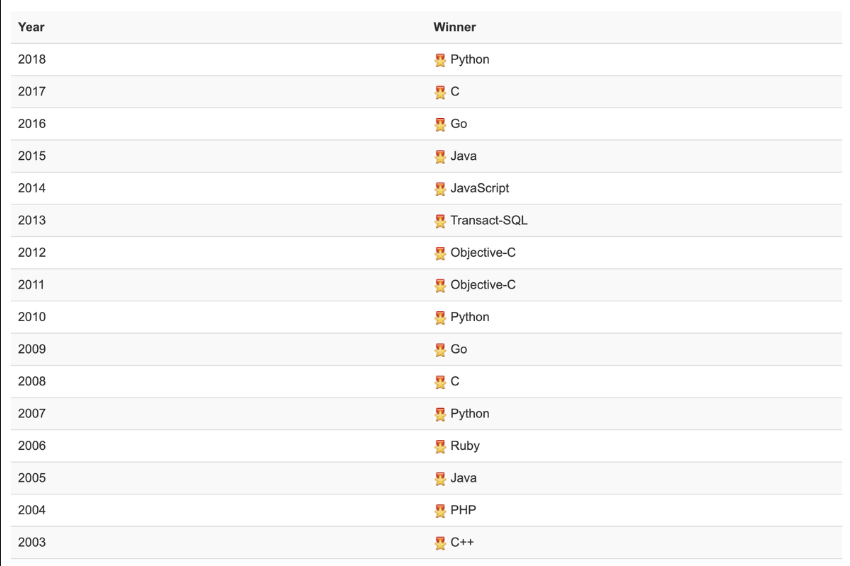

# Origin & Evolution of Go

This section provides a brief introduction to the Go programming language by discussing its history and how it outshines other languages.

## Topics

- Introduction
- History
  - Programming language hall of fame

## Introduction

Also known as **Golang**, Go is a programming language design by _Robert Griesemer_, _Rob Pike_, and _Ken Thompson_.
It is an open-source programming language that makes it easy to build simple, reliable, and efficient software solutions.
Go is a statically typed and compiled programming language.
_Statically typed_ means that variable types are explicitly declared and thus are determined at compile time.
Whereas, by _compiled language_ we mean a language that translates source code to machine code before execution.

> **Note**: Throughout the sections of this project's Markdown files, the terms **Go** and **Golang** will be used interchangeably.

## History

Go, developed by Google in 2007 and launched in 2009, is an open-source programming language initially available for Linux and Mac OS, with Windows support announced later in 2009.
The first stable version, Go 1.0, was released in March 2012.
Since then, it has evolved to version 1.12 by March 2019, with ongoing development towards Go 2.0.

## Programming language hall of fame

Go initiated a lot of stir after its public release in January 2010.
In 2009 and again in 2016, Go was pronounced language of the year by Tiobe, which is well-known for its popularity ranking of programming languages.
In this ranking, it secured the 10th place in November 2018, with a popularity of nearly 2.5%.
The Programming Language of the Year award is given to the programming language rated the highest in that year.
Some winners of the year are given below:

