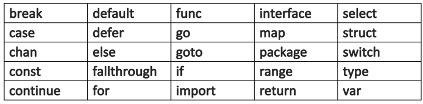
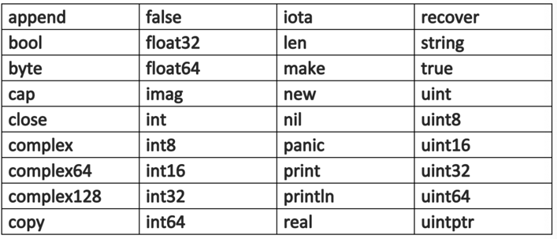

## Filenames, keywords, and identifiers

This section describes what a basic Go program is usually comprised of.

The following topics are covered:
- Filenames
- Keywords
- Identifiers
  - Blank identifier
  - Anonymous
- Basic structure of a Go program

---

### Filename

Go source code is stored in `.go` files.
Their filenames consist of lowercase-letters, like `squidmin.go`.
If the name consists of multiple parts, they are separated by underscores (`_`), like `squidmin_platform.go`.
Filenames cannot contain spaces or any other special characters.
A source file contains code lines whose length has no intrinsic limits.

---

### Keyword

Below is the set of 25 keywords, or reserved words, used in Go code:

---

### Identifiers

An **identifier** is a name assigned by the user to a program element like a variable, a function, a template, a struct, etc.
Nearly all things in Go code have a name or an _identifier_.
Like all other languages in the C-family, Go is case-sensitive.
Valid identifiers begin with a letter (any letter in Unicode UTF-8) or `_` and are followed by 0 or more letters in Unicode digits, like `X56`, `group1`, `_x23`, and `өԑ12`.

The following are not valid identifiers:
- `1ab`, because is starts with a digit
- `case`, because it is a keyword in Go
- `a+b`, because basic operators are not allowed

Apart from the keywords, Go has a set of 36 **predeclared identifiers** which contain the names of elementary types and some basic built-in functions:

---

### Blank identifier

The `_` itself is a special identifier, called the **blank identifier**.
Like any other identifier, `_` can be used in declarations or variable assignments (and any type can be assigned to it).
However, its value is discarded, so it can no longer be used in the code that follows.

---

### Anonymous

Sometimes it's possible that even functions have no name because it is not really necessary at that point in the code and not having a name even enhances flexibility.
Such functions are called **anonymous**.

---

## The basic structure of a Go program

Programs consist of _keywords_, _constants_, _variables_, _operators_, _types_, and _functions_.
It is also important to know the delimiter and punctuation characters that are a part of Golang.

The following _delimiters_ are used in a Go program:
- `.`
- `,`
- `;`
- `:`
- `...`

The code is structured in statements.
A statement doesn't need to end with a `;` (like it is imposed on the C-family of languages).
The go compiler automatically inserts semicolons at the end of statements.
However, if multiple statements are written on one line (a practice which is not encouraged for readability reasons), they must be separated by `;`.
