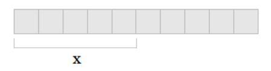

## Slices


### Syntax

```go
var x []float64
```

A _slice_ is a segment of an array.
Like arrays, slices are sequence types.
An element of a slice is accessed via an index.
Unlike arrays, the length of a slice is allowed to change.

To create a slice, use the built-in `make` function.

```go
x := make([]float64, 5)
```

The above declaration example creates a slice that is associated with an underlying `float64` array of length **5**.
Slices are always associated with some array, and although they can never be longer than the array, they can be smaller.
The `make` function also allows a third parameter:

```go
x := make([]float64, 5, 10)
```

**10** represents the capacity of an underlying array which the slice points to:



Another way to create slices is to use the `[low : high]` expression:

```go
arr := []float64{1,2,3,4,5}
x := arr[0:5]
```

`low` is the index of where to start the slice and `high` is the index of where to end it (but not including the index itself).

For example, where `arr[0:5]` returns

```
[1,2,3,4,5]
```

`arr[1:4]` returns

```
[2,3,4]
```

For convenience, the `low` and `high` indices can be omitted, or even both `low` and `high`.

- `arr[:0]` is the same as `arr[0:len(arr)]`
- `arr[:5]` is the same as `arr[0:5]`
- `arr[:]` is the same as `arr[0:len(arr)]`


---


### Slice functions

Go includes two built-in functions to assist with slices:
- `append`
- `copy`

Here is an example of `append`:

<details>
<summary>Example 1: append function</summary>

```go
package main

import "fmt"

func slices1() {
	fmt.Println("Example 1: append function")
	slice1 := []int{1,2,3}
	slice2 := append(slice1, 4, 5)
	fmt.Println(slice1, slice2)
}
```

**Output**

```
Example 1: append function
[1 2 3] [1 2 3 4 5]
```

</details>


<details>
<summary>Example 2: copy function</summary>

```go
package main

import "fmt"

func slices2() {
	fmt.Println("Example 2: copy function")
	slice1 := []int{1,2,3}
	slice2 := make([]int, 2)
	copy(slice2, slice1)
	fmt.Println(slice1, slice2)
}
```

**Output**

```
Example 2: copy function
[1 2 3] [1 2]
```

Since `slice2` only has room for **2** elements, only the first two elements of `slice1` are copied to `slice2`.

</details>
